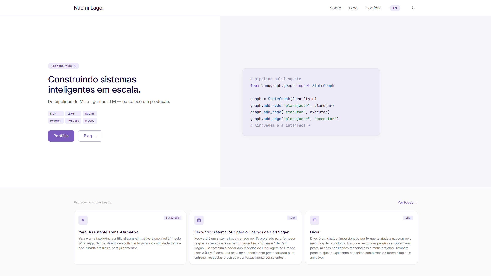

# naomilago.com

Personal website, blog & portfolio — built with Astro, Tailwind CSS, and deployed on Vercel.

---

<br>

<div align="center">
  
</div>

<br>

---

## Stack

- **Framework:** [Astro 4](https://astro.build/)
- **Styling:** [Tailwind CSS](https://tailwindcss.com/)
- **Fonts:** Inter + JetBrains Mono via Google Fonts
- **Syntax highlighting:** Shiki (Catppuccin Mocha theme)
- **Deployment:** [Vercel](https://vercel.com/)
- **i18n:** English & Brazilian Portuguese

---

## Project structure

```text
/
├── public/
├── src/
│   ├── components/
│   │   ├── Navbar.astro
│   │   ├── ProjectCard.astro
│   │   └── BlogPostRow.astro
│   ├── content/
│   │   └── blog/
│   ├── i18n/
│   │   ├── en.json
│   │   └── pt.json
│   ├── layouts/
│   │   ├── BaseLayout.astro
│   │   └── PostLayout.astro
│   ├── pages/
│   │   ├── index.astro
│   │   ├── about.astro
│   │   ├── portfolio/
│   │   ├── blog/
│   │   └── pt/
│   └── styles/
│       └── global.css
└── package.json
```

---

## Commands

All commands are run from the root of the project:

| Command           | Action                                      |
| :---------------- | :------------------------------------------ |
| `npm install`     | Install dependencies                        |
| `npm run dev`     | Start local dev server at `localhost:4321`  |
| `npm run build`   | Build production site to `./dist/`          |
| `npm run preview` | Preview production build locally            |

---

## Publishing a blog post

Create a `.md` file in `src/content/blog/` with the following frontmatter:

```yaml
---
title: ''
date: ''
tags: []
excerpt: ''
lang: 'en'       # 'en' or 'pt'
readTime: ''
---
```

Posts can be written in English or Portuguese — no translation required. If a post only exists in one language, a notice is shown to readers in the other language.

To publish a Jupyter notebook, convert it first:

```bash
jupyter nbconvert --to markdown notebook.ipynb
```

Then add the frontmatter and commit the `.md` file.

---

## License

MIT